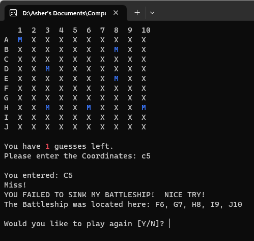

# **Simple Battleship APP**

*A simple Battleship Game to learn C#*

You can run the program from [here](https://replit.com/@AsherGreen/Simple-Battleship-1).
  

## **Summary**

I created this game to learn C#.

To Run the game, just click on the play button and the game will execute.  Enter your name and the game starts.  To play, enter in the letter first and then the number to select what position on the gameboard you want to strike.  You will have 8 chances to sink the Battleship.

GOOD LUCK!

#### **Author**

Asher Green - *Full Stack Developer* \
[website](http://www.ashergreen.ca) | [LinkedIn](https://www.linkedin.com/in/asher-green-6a96551/)
